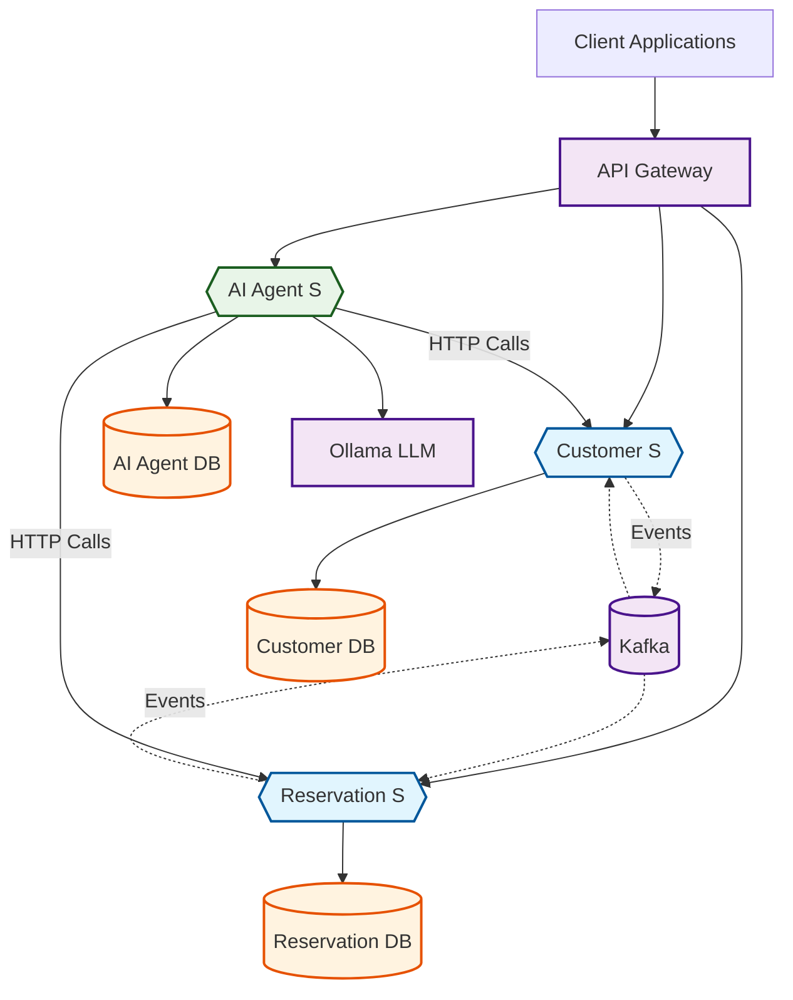

# CQRS Reservation Reactive System

A comprehensive reactive microservices system built using **Kotlin**, **Spring Boot**, and **Gradle**. This system demonstrates enterprise-grade architecture patterns including CQRS, Event Sourcing, and Domain-Driven Design, with AI integration capabilities.

## 🏗️ Architecture Overview

The system leverages **Apache Kafka** for event-driven communication, **Apache Cassandra** for data persistence, and **Redis** for distributed locking. The entire system is containerized using **Docker** and follows reactive programming principles.

### System Architecture Diagram



## 🚀 System Components

### Core Microservices

1. **Customer Service** (`customer/`) - Handles customer registration and reservation status management
2. **Reservation Service** (`reservation/`) - Manages reservations and time slot availability
3. **AI Agent Service** (`ai-agent/`) - Provides intelligent assistance and automation using LangChain4j
4. **API Gateway** (`api-gateway/`) - Routes and manages external API requests
5. **Customer Support** (`customer-support/`) - Handles customer support operations

### Infrastructure Components

- **Apache Kafka** - Event streaming and inter-service communication
- **Apache Cassandra** - Primary data store with event sourcing support
- **Redis** - Distributed locking and caching

### Shared Libraries

- **@ddd Framework** (`@ddd/`) - Custom DDD framework providing:
  - Domain persistence layer
  - Event storage with Cassandra adapter
  - View projections
  - Locking mechanisms (in-memory and Redis)
  - JSON serialization for event storage
- **Common Components** (`common-components/`) - Shared utilities and configurations

### Testing Infrastructure

- **System Integration Tests** (`reservation-system-checks-tests/`) - End-to-end system validation
- **Shared Test Utilities** (`@ddd/shared-kernel-test-cassandra-db/`) - Cassandra testing support

## 🔄 Event-Driven Interactions

The microservices communicate exclusively through asynchronous events published to Kafka topics, ensuring loose coupling and high scalability:

1. **Customer Registration**: `CustomerRegistered` event triggers customer onboarding
2. **Reservation Request**: `CustomerReservationRequested` initiates reservation processing
3. **Reservation Processing**: `ReservationAccepted`/`ReservationDeclined` events update customer status
4. **Time Slot Management**: `TimeSlotBooked`/`TimeSlotUpdated`/`TimeSlotCreated` events manage availability

## 🤖 AI Integration

The system includes an AI Agent service powered by **LangChain4j** that serves as a **Proof of Concept (PoC)** demonstrating how to integrate LLM agents into enterprise systems using **locally running LLM models**. The implementation uses:

- **Dual Model Architecture**: A larger model for conversational chat and a smaller model for request classification
- **Local LLM Deployment**: All models run locally via Ollama, ensuring data privacy and enterprise compliance
- **Function Tool Integration**: Chat capabilities with integrated function tools for business operations
- **Event Sourcing for Chat History**: Leverages the custom @ddd framework with event sourcing to persist and reconstruct chat conversations, demonstrating the power and flexibility of Event Sourcing and CQRS patterns in non-traditional domains

### Capabilities

- **Customer Management**: Register new customers with personal details (name, email)
- **Customer Lookup**: Find existing customers by their information
- **Reservation Operations**: Create reservations for existing customers with specific time slots
- **Time Slot Discovery**: Find available time slots within specified time windows
- **Reservation History**: List all confirmed reservations for a customer
- **Natural Language Interface**: Chat-based interaction using locally deployed Ollama models
- **Persistent Chat History**: Event-sourced chat conversations that can be replayed and analyzed

The AI agents use function calling to execute business operations through the existing microservices APIs, enabling users to perform complex reservation workflows through simple conversational interactions. This PoC demonstrates AI integration patterns while maintaining data sovereignty through local model deployment.

**Event Sourcing Innovation**: The AI Agent service showcases how the @ddd framework's Event Sourcing capabilities can be applied beyond traditional business domains. Chat conversations are stored as immutable events, allowing for complete conversation reconstruction, audit trails, and advanced analytics - proving the versatility and power of CQRS/Event Sourcing patterns in modern AI-driven applications.

## 🏛️ Customer Microservice

Handles all customer-related operations following DDD and Event Sourcing principles.

### Aggregates

- **Customer Aggregate**: Manages customer lifecycle with states:
  - `EmptyCustomer` - Unregistered customer state
  - `ExistingCustomer` - Registered customer with reservation history

### Commands & Events

**Commands**: `RegisterCustomer`, `RequestNewCustomerReservation`, `UpdateCustomerReservationAsConfirmed`, `UpdateCustomerReservationAsDeclined`

**Events**: `CustomerRegistered`, `CustomerReservationRequested`, `CustomerReservationConfirmed`, `CustomerReservationDeclined`

### Use Cases

- **RegisterCustomerUseCase** - Customer registration workflow
- **ReservationToCustomerUseCase** - Handles reservation status updates

## 🏛️ Reservation Microservice

Manages reservation lifecycle and time slot availability.

### Aggregates

1. **ReservationAggregate** - Handles reservation operations
   - **Commands**: `RequestReservation`, `AcceptReservation`, `DeclineReservation`
   - **Events**: `ReservationRequested`, `ReservationAccepted`, `ReservationDeclined`

2. **TimeSlotAggregate** - Manages time slot availability
   - **Commands**: `BookTimeSlot`, `CreateTimeSlot`, `UpdateTimeSlot`
   - **Events**: `TimeSlotBooked`, `TimeSlotCreated`, `TimeSlotUpdated`

### Use Cases

- **CustomerToReservationUseCase** - Processes customer reservation requests
- **TimeSlotToReservationUseCase** - Manages time slot booking
- **ReservationToTimeSlotUseCase** - Handles time slot state changes

## 🛠️ Getting Started

### Prerequisites

- **Java 21**
- **Docker & Docker Compose**
- **Gradle 8.x**

### Quick Start

1. **Build the system**
   ```bash
   ./gradlew build
   ```

2. **Run with Docker Compose profiles**
   
   The system uses Docker Compose profiles to run different service combinations:
   
   ```bash
   # Complete system with AI agent
   docker-compose --profile ai up
   
   # Core system for testing (customer + reservation services)
   docker-compose --profile system-checks up
   
   # Infrastructure only (Kafka, Cassandra, Redis)
   docker-compose up -d
   ```

### Service Endpoints

- **Customer Service**: http://localhost:8082
- **Reservation Service**: http://localhost:8081
- **AI Agent Service**: http://localhost:8083
- **Kafka Control Center**: http://localhost:9021

## 🧪 Testing

Run the complete test suite:
```bash
./gradlew test
```

Run system integration tests:
```bash
./gradlew systemTest
```

## 📊 Monitoring

- **Kafka Topics**: Monitor through Confluent Control Center at http://localhost:9021
- **Application Health**: Each service exposes Spring Boot Actuator endpoints
- **Database**: Cassandra CQL shell available via Docker

## 🔧 Configuration

The system uses environment-based configuration:

- **BROKERS**: Kafka broker addresses
- **CASSANDRA_DB**: Cassandra database host
- **REDIS_DB**: Redis database host

Each service maintains separate Cassandra keyspaces:
- `customer_keyspace` - Customer service data
- `reservation_keyspace` - Reservation service data  
- `ai_agent_keyspace` - AI agent service data

---

**Copyright (2024) Michal Zeman, zeman.michal@yahoo.com**

Licensed under the Creative Commons Attribution (CC BY) license. You are free to share, copy, distribute, 
and adapt this work, provided you give appropriate credit to the original author Michal Zeman, zeman.michal@yahoo.com.

To view a copy of the license, visit https://creativecommons.org/licenses/by/4.0/
